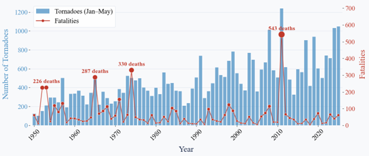
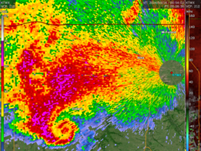
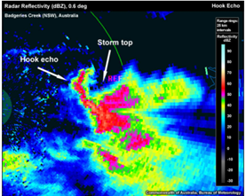
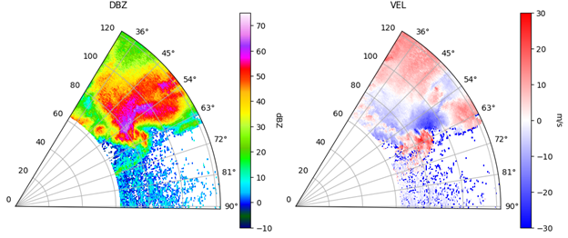
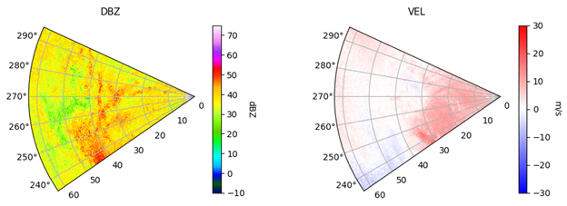
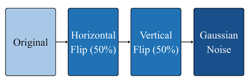
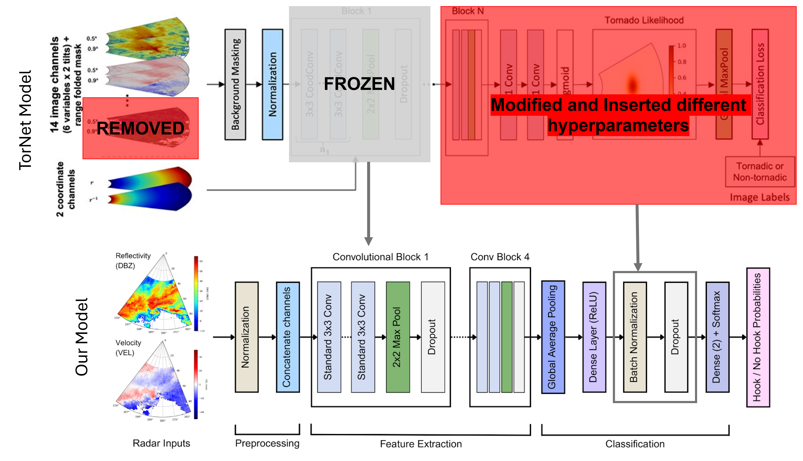
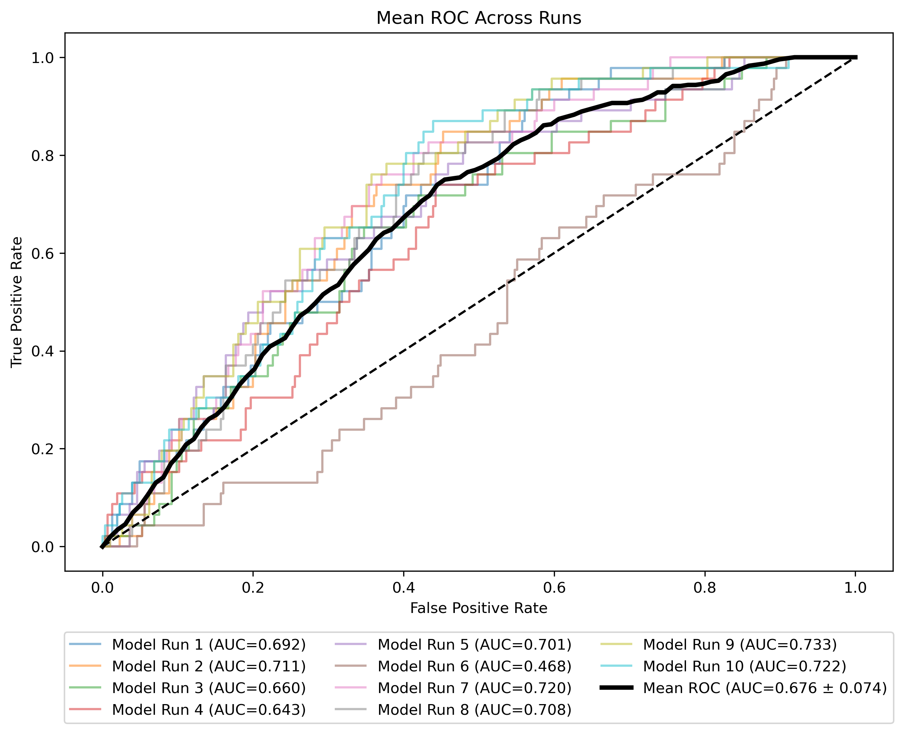
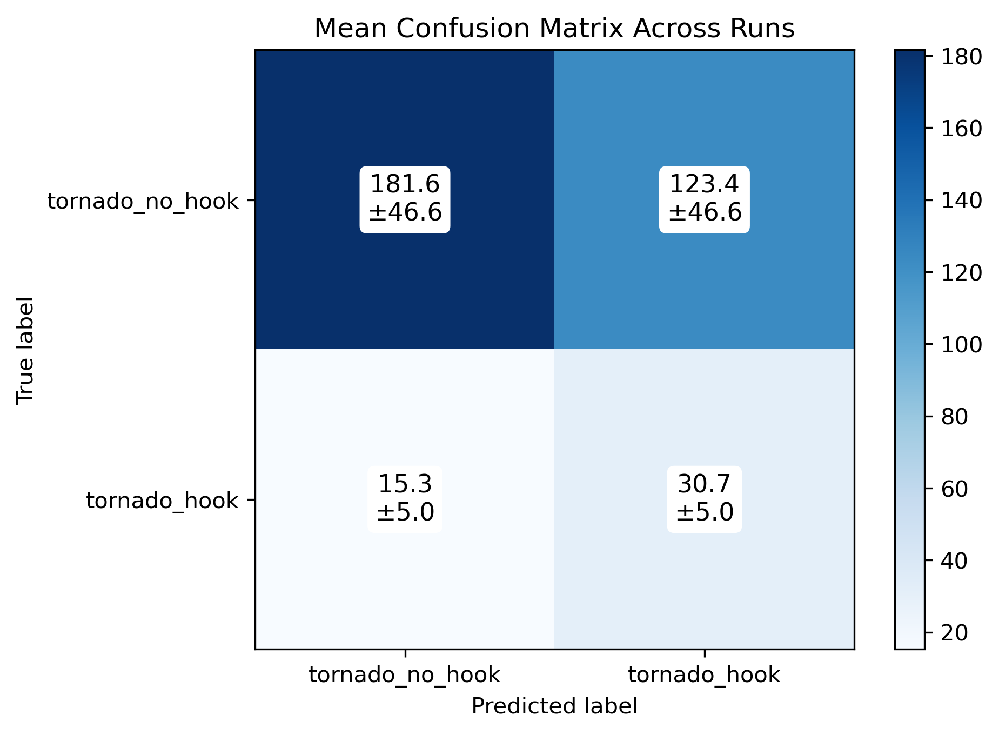
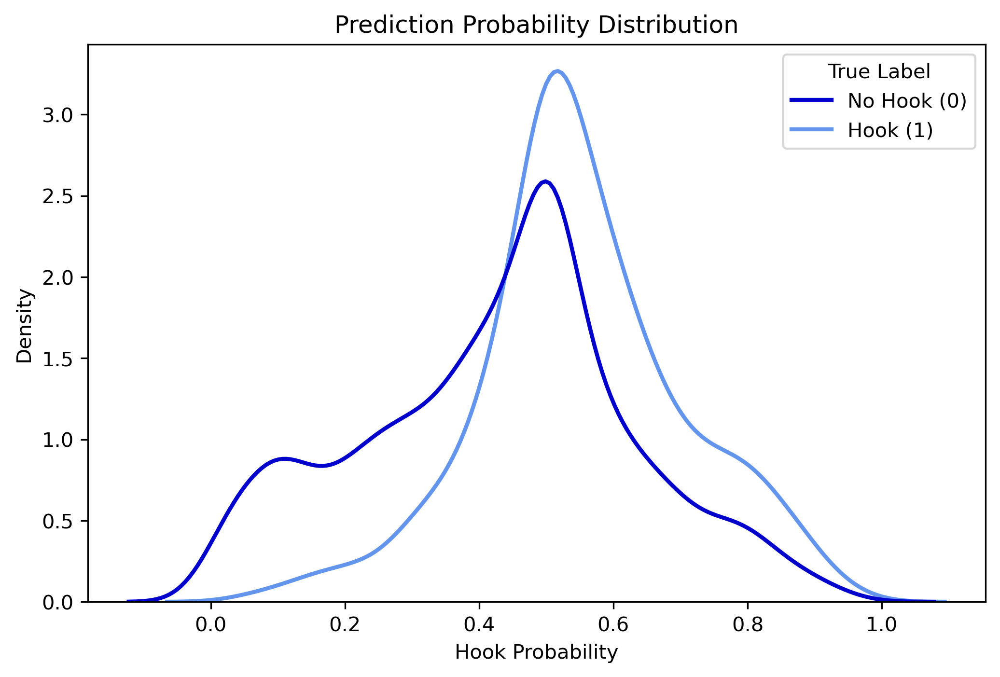

# Tornado Hook Identification using a CNN - Final Project Report

## Clouds Team
Angel Chui - 2nd year ATMOS grad   
Sofia Vakhutinsky - 2nd year ATMOS grad  
Lesly Silva - 4th year ESS undergrad    
*Some formatting for this markdown file used AI/LLM (e.g. ChatGPT, Claude)*

## Introduction
- Tornadoes are dangerous and pose a large risk to human life and society, therefore exploring methods to improve forecasting is an important task.  
**Figure 1:** Annual tornado counts (bars) and associated fatalities (line) in the United States since 1950, highlighting the persistent societal risk posed by severe storms. Data Source: NOAA SPC.  

- One way scientists identify tornadoes on radar is by looking for hook echoes, which are hook, bean, or pendant-like shapes visible on radar that occur when rain or hail is wrapping around a rotating storm. 
- This final class project for ESS 469/569 aims to explore the use of machine learning, specifically a Convolutional Neural Network (CNN), for identifying tornado hook echoes on radar imagery. 
- ***Project Question: How can we use machine learning to identify tornado hook echoes in radar imagery?***  
**Figure 2:** Examples of radar imagery showing different types of hook echoes with the left image showing a classic defined hook shape while the image on the right shows a more pendant or appendage-shaped hook. 

## Background
- The National Weather Service (NWS) Weather Surveillance Radar-1988 Doppler system (WSR-88D) was launched in 1988 and became the core radar observational system used for forecasting and research in the United States.
- Linear statistical methods and threshold-based algorithms were developed for tornado prediction during the 1980s through 1990s, such as the Mesoscale Detection Algorithm (MDA).
- In the 2000s onwards, machine learning (ML) techniques were developed that used binary classification and CNNs to work with outputs from MDA to create modern day tornado forecasting methods.
- In 2025, a comprehensive dataset of 9 years of observational data from the WSR-88D system was created as part of the TorNet study, which used this dataset to train a CNN and compare this with other ML methods (random forests and logistic regression) and traditional forecasting methods (tornado vortex signature) using the same dataset.
    -  Veillette, M. S., Kurdzo, J. M., Stepanian, P. M., Cho, J. Y. N., Reis, T., Samsi, S., McDonald, J., & Chisler, N. (2025). A Benchmark Dataset for Tornado Detection and Prediction Using Full-Resolution Polarimetric Weather Radar Data. Artificial Intelligence for the Earth Systems, 4(1). https://doi.org/10.1175/AIES-D-24-0006.1  
    - TorNet github: https://github.com/mit-ll/tornet

## Inputs/Outputs
### Inputs
#### TorNet Data Structure
- The TorNet dataset includes over 200,000 samples of storm events, each with the storm centered on a radar ‘chip’ or subsection of a Plan Position Indicator (PPI) radar scan. In each event, there were also 4 time frames, at 2 tilts, or angles above ground that the radar was scanning at. 
- These radar images were stored as NetCDF files with 4 dimensions: time, azimuth, range, and sweep. There were six radar variables recorded; however, we chose to use only two of these for our model to reduce dimensionality: Reflectivity (DBZ) and Radial Velocity (VEL), which are the most useful for identifying hook echoes.
- The storm events from the TorNet data set were also subset into three categories: confirmed tornado [TOR] (6.8%), a tornado warning occurred but no tornado formed [WRN] (31.8%), and non-tornadic storm cells [NUL] (61.4%).
#### Selecting a Subset of TorNet Data
- From the [TOR]  category, we randomly selected cases and labelled each frame with a binary classification of a tornado with a hook (1) or a tornado without a hook (0).
- Our final numbers for the trained data input were 1523 of tornadoes without hooks (0) and 228 of tornadoes with hooks (1). So 12.6% of the input data had hooks and 87.4% did not have hooks.
- This trained data was also split 80/20, as our training, and validation data, respectively.  
**Figure 3:** Shows examples from our training data of what a tornado without hook and tornado with hook looks like.  
Below is a radar image showing a tornado with a hook.
  
Below is a radar image showing a tornado without a hook.
.

#### Data Augmentation of Input Data
- After initial model runs with the training data input described above, model performance was poor and performance metrics showed that the model was mostly labeling images as “tornado no hook”. We presume one of the main causes of this is the large class imbalance between tornado with hook and tornado without hook (12.6% vs 87.4%, respectively).
- To handle the natural class imbalance that exists for the presence of tornado hooks in the data, we implemented balanced batching. 
    - Balanced batching - after the 80/20 train/test split is implemented on the input data, we created training batches that consisted of 8 total samples with 4 randomly chosen tornado with hook samples and 4 randomly chosen tornado without hook samples (creating 50/50 class balance). This technique allows the rarer tornado with hook samples to be seen multiple times while only a subset of the tornado without hook samples are seen in each epoch.
- Additionally, in order to improve model performance, we implemented data augmentation techniques on the input data. Figure 4 below shows the order in which we implemented data augmentation on our input data.  
**Figure 4:** The following data augmentation techniques were applied to our labeled samples of both classes in the order shown: Random horizontal flips on 50% of the images from both classes, random vertical flips on 50% of the images from both classes, random small Gaussian Noise on all samples from both classes.  
  

### Outputs
- Labelled radar images as tornado with hook or tornado without hook.
- For model evaluation, we checked whether the outputs were true/false positives and true/false negatives.

## ML approach
- The model used for this project can be found in this repository in the notebook: torhook_model.ipynb
- Our model is based on the baseline CNN used in the TorNet study from 2025. This model uses Keras 3.0 and Tensorflow to create the model architecture and do the calculations.
- The TorNet CNN uses inputs from the TorNet dataset and the output is a heatmap that shows the probability of when and where a tornado will occur.
- We originally chose this model because we had a second goal of using the outputs from our current model to forecast tornados so we chose an existing model that had similar outputs.
- We used their model for transfer learning by freezing all convolutional layers in their model except for the last 15 layers and removing their output layers. Figure 5 below depicts how we changed the TorNet architecture for transfer learning and our new output hyperparameters.  
**Figure 5:** Shows the TorNet CNN architecture (top) and our CNN architecture (bottom) and how we performed the transfer learning.  

- Additional details about our model hyperparameters are listed below:
    - Output/Classification layers:
        - Global Average Pooling (2D) - compresses each feature map into a single number by averaging.
        - ReLu Activation function - introduces non-linearity, which we need for curved hook features in radar.
        - Batch Normalization - normalizes the global average pooling and ReLu, helping model/data stabilize.
        - Dropout (50%) - randomly disables half the neurons during each training batch to prevent overfitting.
        - Softmax Activation Function - converts the final two neuron outputs into probabilities that sum to 1.
    - Learning/Training Hyperparameters used in the last 15 unfrozen layers.
        - Optimizer: Adam, adjusted learning rate: 3e-5
        - Loss: sparse categorical cross entropy - penalizes confident wrong predictions.
        - Early stopping based on validation loss - usually around 15 epochs.

## Results
- Though we got our model to perform a bit better than random guessing, the performance was still not very good at identifying hook echoes. 
 
**Figure 6:** Mean ROC Curve generated from results of 10 model runs.  

 
Looking at Figure 6, we can see that most of the runs did better than random chance (barely), with Run 7 actually doing worse than random. Although this means that the model is learning something, the fact that at least 10% of the runs could perform only about good as random guessing means our model is unstable and not very accurate. 
  
**Figure 7:** Mean Confusion Matrix generated from results of 10 model runs.  

  
Figure 7, our mean confusion matrix shows that it ended up getting about ⅔ of the tornado hooks correct, and slightly over half of the no-hooks correct. This means our model did not do very well, but considering our model previously was not categorizing any of the hooks correctly, the final version of the model was at least learning something.
  
**Figure 8:** Model Prediction Probability based on 10 model runs.  

 
Looking at Figure 8, our prediction probability distribution confirms our previous findings. Both curves sit in about the .4 - .6 range, meaning our model is fairly uncertain. However, the hook distribution is in a slightly higher range than the non-hook distribution, showing that our model is slightly more confident in identifying hooks than non-hooks. 

## Discussion
- We believe the best explanation for our model’s subpar performance is the way we chose to train our data. Although hook echoes are a way scientists use to identify tornadoes, it is more of a colloquial term than anything else. There are no official classifications or definitions for what these hooks actually look like. Even the official definition lists several different shapes the hook could look like. 
- This made it hard to actually label the data, and we as a group struggled to come up with a concrete definition of what exactly we were looking for. Though some hooks were very clear and well-defined, many weren’t, which left a lot of ambiguity in our training data.
-This ambiguity, we believe, is what led to most of the errors with our model. If we didn’t know what we were looking for, how could the model?

## Future Work
- Determine a new method of labelling/identifying tornado hook echoes on radar. This would involve creating a firm definition of a radar hook echo.
- Soliciting expert opinions on what is or is not a hook echo may help with improving training data.

